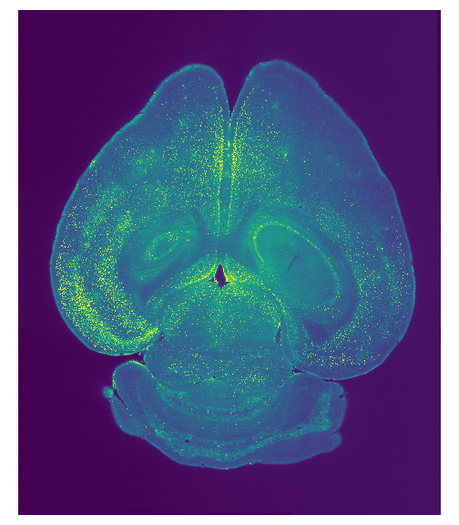

# Example: brain registration 
- Download the demo dataset for registration: https://lightsheetatlas.pni.princeton.edu/public/brainpipe_demo_datasets/lavision_1.3x_twochannels_z4um_demodataset.tar.gz.
- Unpack it: 
```
tar -zxvf lavision_1.3x_twochannels_z4um_demodataset.tar.gz`
```
This unpacks into a directory containing two directories, one for each channel:
```
└── lavision_1.3x_twochannels_z4um_demodataset
    ├── ch488_z10um
    └── ch647_z10um
```
Each channel folder contains 696 .tif files, each representing a single horizontal slice through a mouse brain from a single lightsheet (left lightsheet only). These will be referred to as "Z planes" hereafter. Each Z plane is spaced by 10 microns and has pixels which are 5 microns on a side. This dataset is not tiled in X and Y, so it does not need to be stitched (see other example below for how to stitch a dataset that is tiled). 

The file format is:
```
15-24-10_UltraII_raw_RawDataStack[00 x 00]_C00_xyz-Table Z{ZPLANE_CODE}_UltraII Filter0000.ome.tif
```
where {ZPLANE_CODE} is a 4 digit 0-padded string representing the z plane index, which is 0-indexed.

- The file `parameter_dictionary.py` sets up a dictionary containing all of the information that will be needed to run the code. Edit this file according to its documentation. Most importantly, the `inputdictionary` needs to look something like this:
```
inputdictionary={
    "/path/to/lavision_1.3x_twochannels_z4um_demodataset/ch488_z10um": 
    [["regch","00"]],
    "/path/to/lavision_1.3x_twochannels_z4um_demodataset/ch647_z10um": 
    [["cellch","00"]]
}
```
Also make sure to set:
```
"stitchingmethod": "blending"
```
and
```
"xyz_scale": (10.0,10.0,10.0)
```
and set your `outputdirectory` to where you want to save the outputted data products.

The file `main.py` actually runs the registration pipeline and imports the file `parameter_dictionary.py`. The registration pipeline has four steps, where the step index is the first command line argument you pass to `main.py`. 
 
## Registration on a local machine 
This is useful to run through once even if you ultimately plan to run the pipeline on a computing cluster.

If on a local machine, first activate your anaconda environment:
```
conda activate brainpipe
```
Then run the following steps from the command line. 
### Step 0:
```
python main.py 0
# or: python main.py 0 2>&1 | tee logs/step0.log # if you want to log output to a file and see stdout while the program is running
```
This will create the `outputdirectory` directory that you set in `parameter_dictionary.py` and write a few files and sub-directories in there. 
### Step 1:
```
python main.py 1 $jobid
```
If any channels of your raw data consist of multiple light-sheets or multiple tiles, this step will blend and stitch them into a single file for each Z plane. In this example, we are only using 1 light sheet per plane and 1 tile per plane so no blending or stitching will occur. Note that there is a second command line argument passed to `main.py` for this step, $jobid. 

In our example here where we are not stitching, the `jobid` parameter is used to index which chunk of Z planes to work on (see the stitching example below where this parameter has a different meaning). The `slurmjobfactor` parameter in `parameter_dictionary.py` determines how many planes to work on for each jobid, so if `slurmjobfactor: 50` (the default), then for `jobid=0` Z planes 0-49 are processed. For `jobid=1` Z planes 50-99 are processed, and so on. You will need to run this step with multiple jobids until all of your Z planes are processed. For this example there are 696 Z planes, so a total of 14 (0-13) jobids are needed. This step is a lot more convenient to run via slurm on a computing cluster due to the `--array` notation, but for a local machine one could just write a script to run this step for all 14 job ids simultaneously. 

Even if you do not need to blend or stitch your data, you still need to run this step, as it creates files that later steps in the pipeline read. It should take less than one minute for this demo. The Z planes created during this step will be created in a sub-directory called `full_sizedatafld/` inside your `outputdirectory`. Each channel will have its own sub-directory inside of this directory. These Z planes will have the same voxel resolution as your raw data. For example you should see 696 Z planes in: `full_sizedatafld/ch488_ch00` of the format `ch488_C00_Z????.tif`, likewise for ch647. 

### Step 2:
```
python main.py 2 $jobid
```
For each channel you specified in `parameter_dictionary.py`, this step will downsize the volume to dimensions that are closer to the dimensions of the reference atlas volume you set in `parameter_dictionary.py`, in preparation for the registration in the following step. It will also reorient your data to the same orientation as the reference atlas volume, if necessary. It also creates a single tif file for each downsized channel representing the entire volume. Here the `jobid` is used to index which channel to downsize, so run this step for each channel index like:

```
python main.py 2 0
python main.py 2 1
```
This step should only take a few seconds. 

You should now see a `ch488_resized_ch00.tif` and `ch647_resized_ch00.tif` that were created in the `outputdirectory`. These files are oriented the same as the reference atlas and downsized in your original data x and y dimensions by a factor of `resizefactor` that you set in `parameter_dictionary.py`. 


### Step 3:
This step first resamples the downsized files from Step 2 so that they are 1.4x the size of reference atlas in x, y and z dimensions. This is an optimal factor for performing registration. These resampled and downsized files are saved as `ch488_resized_ch00_resampledforelastix.tif` and `ch488_resized_ch00_resampledforelastix.tif` in `outputdirectory` during this step. These files are then used as the inputs for the registration to the reference atlas specified in `parameter_dictionary.py`. Whichever channel you set as the `regch` in `parameter_dictionary` will be directly registered to the atlas, since this is often the autofluorescence channel which is closest in appeareance to the atlas. The other channels, if set as `injch` or `cellch` in `parameter_dictionary.py` will first be registered to the `regch` channel and then registered to the atlas. This two-step registration process for non-autofluorescent channels typically results in a better final registration of these channels to the reference atlas. 
```
python main.py 3 $jobid
```

In this step, the `jobid` command line argument references the channel type via: 
```
jobid = 
        0: 'normal registration'
        1: 'cellchannel'
        2: 'injchannel`
```
Therefore when you run:
```
python main.py 3 0
```

A directory called `elastix` will be created in your `outputdirectory`, which will contain the registration results between the `regch` and the `AtlasFile` you set in `parameter_dictionary.py`. The files: `result.0.tif` and `result.1.tif` in `elastix/` directory refer to registration channel volume that has been registered to the reference atlas coordinate space. `result.0.tif` is the volume after an affine transformation, `result.1.tif` is the volume after affine + bspline transformation, and is usually the more accurate result. 

Inside of `elastix`, a directory called `ch647_resized_ch00` will be created, which will contain the following contents:
```
ch647_resized_ch00/
├── result.tif
├── sig_to_reg
│       ├── elastix.log
│       ├── IterationInfo.0.R0.txt
│       ├── IterationInfo.0.R1.txt
│       ├── IterationInfo.0.R2.txt
│       ├── IterationInfo.0.R3.txt
│       ├── IterationInfo.0.R4.txt
│       ├── IterationInfo.0.R5.txt
│       ├── IterationInfo.0.R6.txt
│       ├── IterationInfo.0.R7.txt
│       ├── IterationInfo.1.R0.txt
│       ├── IterationInfo.1.R1.txt
│       ├── IterationInfo.1.R2.txt
│       ├── IterationInfo.1.R3.txt
│       ├── IterationInfo.1.R4.txt
│       ├── IterationInfo.1.R5.txt
│       ├── IterationInfo.1.R6.txt
│       ├── IterationInfo.1.R7.txt
│       ├── LogFile.txt
│       ├── regtoatlas_TransformParameters.0.txt
│       ├── regtoatlas_TransformParameters.1.txt
│       ├── result.0.tif
│       ├── result.1.tif
│       ├── TransformParameters.0.txt
│       └── TransformParameters.1.txt
└── transformix.log
```

The `sig_to_reg` folder contains the elastix transformation results between the signal channel (cell channel) in our case and the registration channel. The file `sig_to_reg/result.1.tif` is the cell channel volume registered to the 488 (registration channel) coordinate space. The file `result.tif` is the cell channel file registered to the atlas space. The reason we include the `sig_to_reg` folder is if there the registration and non-registration channel are not well aligned. In that case, you can use the `sig_to_reg` folder to apply a two-step registration process. This would be sig -> reg -> atlas, instead of sig -> atlas. This is not needed in this example, but the code performs that transformation just in case. 

Using `jobid=0` will allow you to register the brain volumes to the atlas, but often it is of interest to register cells or other detected objects in a non-registration image channel to the atlas. That is what the other `jobid` values are for. For example:
```
python main.py 3 1
```
will create a folder called `elastix_inverse_transform` in your `outputdirectory` containing the inverse transforms of the normal registration achieved with `jobid=0`. These inverse transforms are necessary for transforming coordinates in the cell channel volume to the atlas coordinate space. 

## Registration on a computing cluster
Instead of running the steps with Python from the command line, you will run a sequence of sbatch scripts. This can either be done from a bash file all at once or one by one from the command line. In this example we will run the sbatch scripts one by one to illustrate them more clearly. 

### Step 0:
This will produce all of the same outputs as running on a local machine, so refer to the steps of that section for the description of output files. 
Modify `slurm_files/step0.sh` to point to the correct modules set up on your cluster. Then run:
```
sbatch slurm_files/step0.sh
```
### Step 1:
Modify `slurm_files/step1.sh` to point to the correct modules set up on your cluster. As when running this on a local machine, we need to determine ahead of time how many array jobs we will need to cover all Z planes. In our example we will need 14 array jobs if we have `slurmjobfactor=50`. To submit all 14 of these array jobs for step 1 simultaneously run:
```
sbatch --array=0-13 slurm_files/step1.sh
```
### Step 2:
Modify `slurm_files/step2.sh` to point to the correct modules set up on your cluster. This step is slightly simpler on the cluster since we can submit both channels simultaneously using two array jobs:
```
sbatch --array=0-1 slurm_files/step2.sh
```

### Step 3:
Modify `slurm_files/step3.sh` to point to the correct modules set up on your cluster. This step is slightly simpler on the cluster since we can submit both the normal registration (--array=0) and inverse registration (--array=1) simultaneously using two array jobs:
```
sbatch --array=0-1 slurm_files/step3.sh
```
Conveniently, slurm has an option that allows you to make sbatch commands dependent on other sbatch commands. Because we need to run these steps sequentially, we can chain them together in a dependency chain and run them all in a single script. The file: `example_registration_pipeline.sh` does exactly that. That is a bash script which can be executed like:
```
./example_registration_pipeline.sh
```
This will execute all of the same sbatch commands we ran one by one above. This will hopefully serve as a template for other use cases of BrainPipe.

# Example: Stitching on a local machine and a cluster
- Download the demo dataset for stitching: https://lightsheetatlas.pni.princeton.edu/public/brainpipe_demo_datasets/lavision_4x_cellch_z4um_10percentoverlap_demodataset.tar.gz.
- Unpack it: 
```
tar -zxvf lavision_4x_cellch_z4um_10percentoverlap_demodataset.tar.gz`
```
This unpacks into a single directory with 450 .tif files, representing a 3x3 grid of 25 Z planes taken with two lightsheets (left and right) of a single channel (647nm). Each Z plane is spaced by 4 microns and each Z plane has pixels which are 1.63 microns on a side. The tiling overlap is 10 percent.

The file format is:
```
10-59-43_UltraII_raw_RawDataStack[{X_TILE} x {Y_TILE}]_C{LIGHTSHEET_LR_CODE}_xyz-Table Z{ZPLANE_CODE}_UltraII Filter0000.ome.tif
```
where {X_TILE} and {Y_TILE} are 2 digit 0-padded strings representing the row and column of the tile in the grid, {LIGHTSHEET_LR_CODE} is a 2 digit 0-padded string representing the left or right lightsheet ("00" = Left, "01" = Right), and {ZPLANE_CODE} is a 4 digit 0-padded string representing the z plane index. All of these quantities are 0-indexed. Here is an example to make this more concrete:
`
10-59-43_UltraII_raw_RawDataStack[00 x 01]_C01_xyz-Table Z0000_UltraII Filter0000.ome.tif
`: is Z plane 0 (Z0000) from the first row and second column (00 x 01) from the right lightsheet (C01)  
- After unpacking these files, modify `parameter_dictionary.py` so that `inputdictionary` points to where you downloaded and unzipped the dataset. This dataset only represents a single channel (647nm) which was used to identify cells, so your `inputdictionary` should look something like:
```
inputdictionary={
os.path.join(/path/to/lavision_4x_cellch_z4um_10percentoverlap_demodataset"): 
    [["cellch","00"]]
}
```
- Farther down in `parameter_dictionary.py` make sure to update the following entries in `params` to these values:
        - `"xyz_scale": (1.63,1.63,4)`
        - `"tiling_overlap": 0.1`
        - `"stitchingmethod": "terastitcher"`
Also set `outputdirectory` in to where you want the data products from this demo to be saved.

## Stitching on a local machine instructions:
Once you have set up your `parameter_dictionary.py` file, load your conda environment:
```
conda activate brainpipe
```
Then run step 0:
```
python main.py 0
```
This will create your `outputdirectory` if it does not already exist and populate it with some files, most importantly the parameter dictionary pickle file which will be used in the next step.

Now run step 1 on your only channel:
```
python main.py 1 0
```
This step may take between a few minutes depending on your available computing resources. When it finishes, the 25 stitched and blended full size Z planes (.tif files) will live in `outputdirectory/full_sizedatafld/lavision_4x_cellch_z4um_10percentoverlap_demodataset_ch00`

Visualize them to make sure the stitching worked propertly. The Z=0 plane should look identical (or very close) to this:
<figure>
        
  <figcaption>Figure 1: What the demo Z=0 plane should look like after stitching </figcaption>
</figure>


## Stitching on a computing cluster instructions:
Once you have set up your `parameter_dictionary.py` file, modify `slurm_files/step0.sh` to load the correct module names for your computing cluster. Then run step0 via sbatch:

```
sbatch slurm_files/step0.sh
```

This will create your `outputdirectory` if it does not already exist and populate it with some files, most importantly the parameter dictionary pickle file which will be used in the next step.

Next, modify `slurm_files/step1.sh` to load the correct module names for your computing cluster. Now run step 1, using only a single array job since we just have one channel:
```
sbatch array=0 slurm_files/step1.sh
```
This step should take no more than 10 minutes. When it finishes, the 25 stitched and blended full size Z planes (.tif files) will live in `outputdirectory/full_sizedatafld/n_4x_cellch_z4um_10percentoverlap_de_ch00`

Visualize them to make sure the stitching worked propertly. The Z=0 plane should look identical to Figure 1 above.

# CNN demo 
We set up a demo script to run training and large-scale inference on some randomized data. This is useful to make sure the environment and modules are imported correctly

If working with a slurm-based scheduler:
- run `sbatch run_demo.sh` within `tools/conv_net`
- Note you will need CUDA installed under your username; check with IT on how to setup CUDA properly under your cluster 
- load the modules and environment in the bash script as such (changing names as necessary):
```
module load cudatoolkit/10.0 cudnn/cuda-10.0/7.3.1 anaconda3/5.3.1
 <<<your python environment>>>
```

2. else, navigate to tools/conv_net; in the terminal, in the lightsheet environment, run:
```
$ python setup_demo_script.py
$ cd pytorchutils/
$ python demo.py demo models/RSUNet.py samplers/demo_sampler.py augmentors/flip_rotate.py 10 --batch_sz 1 --nobn --noeval --tag demo
```
3. output will be in a 'tools/conv_net/demo/cnn_output' subfolder (as a TIFF)

Edit: lightsheet/tools/conv_net/pytorchutils:
- main GPU-based scripts are located in the pytorchutils directory
1. `run_exp.py` --> training
    - lines 64-98: modify data directory, train and validation sets, and named experiment         directory (in which the experiment directory of logs and model weights is stored) 
2. `run_fwd.py` --> inference
    - lines 57 & 65: modify experiment and data directory 
3. `run_chnk_fwd.py` --> large-scale inference
    - lines 82 & 90: modify experiment and data directory 
    - if working with a slurm-based scheduler:
        1. modify `run_chnk_fwd.sh` in `pytorchutils/slurm_scripts`
        2. use `python pytorchutils/run_chnk_fwd.py -h` for more info on command line           arguments
4. modify parameters (stride, window, # of iterations, etc.) in the main parameter dictionaries
- `cell_detect.py` --> CPU-based pre-processing and post-processing
        - output is a "3dunet_output" directory containing a '[brain_name]_cell_measures.csv'
    - if working with a slurm-based scheduler, 
        1. `cnn_preprocess.sh` --> chunks full sized data from working processed directory  
        2. `cnn_postprocess.sh` --> reconstructs and uses connected components to find cell measures
        3. these need the same changes as `sub_main_tracing.sh` file, e.g.
```
module load anacondapy/5.3.1
. activate <<<your python environment>>>
```


# CNN paralellization

* for whole brain, cellular resolution image volumes (> 100 GB), the neural network inference is parallelized across multiple chunks of image volumes, and stitched together by taking the maxima at the overlaps of the chunks after inference.
* the chunks are made by running `cnn_preprocess.sh` on a CPU based cluster
* chunks can then be run for inference on a GPU based cluster (after transfer to the GPU based cluster server or on a server that has both CPU and GPU capabilities)
        * by modifying paths in `tools/conv_net/pytorchutils/run_chnk_fwd.py`
        * by then navigating to `tools/conv_net/pytorchutils` and submitting an array batch job
                * the range ("0-150") will depend on how many chunks were made for the whole brain volume, which are typically 80-200
```
sbatch --array=0-150 slurm_scripts/run_chnk_fwd.sh