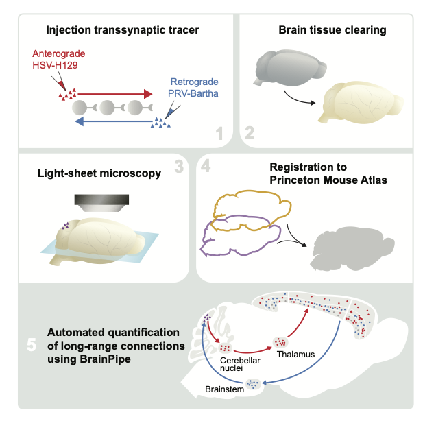

# BrainPipe: Registration and object detection pipelines for three-dimensional whole-brain analysis.

BrainPipe ([Pisano et al. 2021](https://www.sciencedirect.com/science/article/pii/S2211124721011700)) is an automated transsynaptic tracing pipeline that combines anatomical assignment using volumetric registration and injection site segmentation with convolutional neural networks for cell detection.

### Light-sheet microscopy can visualize whole-brain transsynaptic tracing

### Volumetric alignment of brain volumes to the Princeton Mouse Atlas enables automated anatomical assignment

## Installation
Please see [INSTALLATION.md](INSTALLATION.md) for installation instructions.

## Example use cases and tutorials
Please see [EXAMPLES.md](EXAMPLES.md) for basic BrainPipe use cases.

Demonstration datasets to ensure proper usage of BrainPipe and trained CNNs for H129 and PRV detection can be found [here](https://lightsheetatlas.pni.princeton.edu/public/brainpipe_demo_datasets/).

For CNN Demo: [EXAMPLES: CNN Demo](EXAMPLES.md#cnn-demo). Note, pre-trained CNN's ([available here](https://lightsheetatlas.pni.princeton.edu/public/brainpipe_demo_datasets/CNN_pretrained_models.tar.gz)) are a good starting point for transfer learning, but probably will not work out-of-the-box for other projects' datasets. For a tutorial on making your own training set, see [tutorials/make_UNet_training_set.ipynb](tutorials/make_UNet_training_set.ipynb).

For a deeper-dive into the BrainPipe pipeline, please see [IMPORTANT_FILES.md](IMPORTANT_FILES.md) for details. When starting to use your own data, BrainPipe expects certain formatting of images (see [FILE-FORMATTING.md](FILE-FORMATTING.md) for details).

### Convolutional neural networks efficiently and accurately detect virally-labeled neurons in whole cleared mouse brains

## Princeton Mouse Atlas: a volumetric atlas with a complete cerebellum that is compatible with the Allen Brain Atlas

The Princeton Mouse Atlas (PMA) was generated from 110 light-sheet volumes and is compatible with the Allen Brain Atlas. PMA data can be found [here](https://brainmaps.princeton.edu/2020/09/princeton-mouse-brain-atlas-links/). Further PMA details can be found in [Pisano et al. 2021](https://www.sciencedirect.com/science/article/pii/S2211124721011700).

## Aligned viral tracing injection data

Aligned anterograde (HSV-H129) and retrograde (PRV-Bartha) viral tracing injection data from [Pisano et al. 2021](https://www.sciencedirect.com/science/article/pii/S2211124721011700) has been deposited [here](https://brainmaps.princeton.edu/2021/05/pisano_viral_tracing_injections/).
